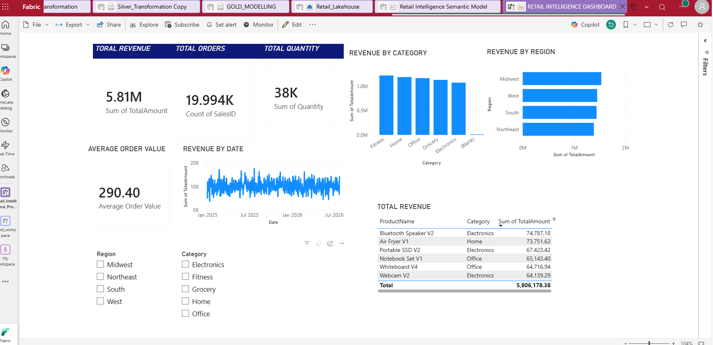
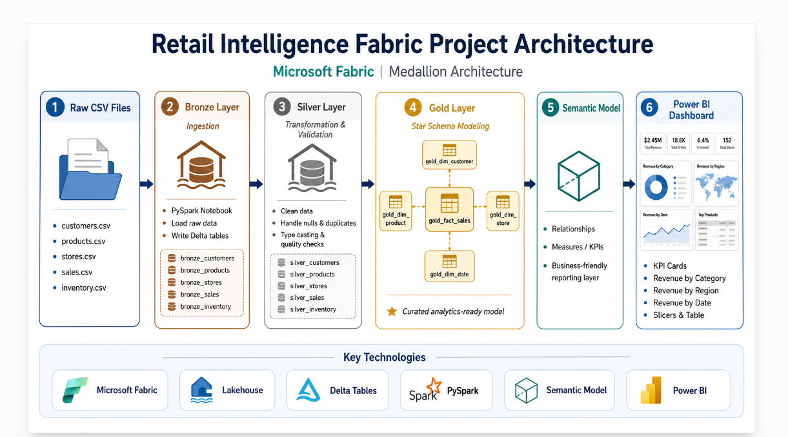

# Retail Intelligence Fabric Project

An end-to-end Microsoft Fabric data engineering project using Medallion Architecture, PySpark, Delta Lake, dimensional modeling, semantic models, and Power BI.

## Project Overview

This project simulates a retail data platform built in Microsoft Fabric.

The solution ingests raw retail data, transforms and validates it through Bronze, Silver, and Gold layers, builds a star schema, and exposes the curated data through a semantic model and Power BI dashboard.

## Architecture

Raw CSV Files  
→ Microsoft Fabric Lakehouse  
→ Bronze Delta Tables  
→ Silver Data Cleaning & Validation  
→ Gold Star Schema  
→ Semantic Model  
→ Power BI Dashboard

## Technologies Used

- Microsoft Fabric
- OneLake
- Lakehouse
- Delta Lake
- PySpark
- Spark SQL
- Medallion Architecture
- Dimensional Modeling
- Power BI
- DAX

## Dataset

Synthetic retail data was used for this project:

- 1,000 Customers
- 200 Products
- 20 Stores
- 20,000 Sales Transactions
- 4,000 Inventory Records

## Bronze Layer

Raw CSV files were ingested into the Fabric Lakehouse and stored as Delta tables.

### Bronze Tables

- bronze_customers
- bronze_products
- bronze_stores
- bronze_sales
- bronze_inventory

## Silver Layer

The Silver layer performs data cleaning and quality validation.

Transformations include:

- Null handling
- Duplicate removal
- Invalid date detection
- Negative value validation
- Missing attribute handling
- Business rule validation
- Data standardization

### Silver Tables

- silver_customers
- silver_products
- silver_stores
- silver_sales
- silver_inventory

## Gold Layer

A star schema was created for analytics and reporting.

### Dimension Tables

- gold_dim_customer
- gold_dim_product
- gold_dim_store
- gold_dim_date

### Fact Table

- gold_fact_sales

Surrogate keys were used to connect the fact table with the dimensions.

## Power BI Dashboard

The semantic model supports an interactive dashboard with:

- Total Revenue
- Total Orders
- Total Quantity
- Average Order Value
- Revenue by Date
- Revenue by Category
- Revenue by Region
- Top Products by Revenue
- Region slicer
- Category slicer

## Key Outcomes

This project demonstrates:

- End-to-end data engineering in Microsoft Fabric
- Medallion Architecture implementation
- PySpark transformations
- Delta Lake table management
- Data quality validation
- Star schema design
- Semantic model relationships
- DAX measures
- Power BI reporting

## Dashboard Preview

## Architecture Diagram

## Notebooks

- [Bronze Ingestion](./notebooks/Bronze_Ingestion.ipynb)
- [Silver Transformation](./notebooks/Silver_Transformation Copy.ipynb)
- [Gold Modeling](./notebooks/GOLD_MODELLING.ipynb)
